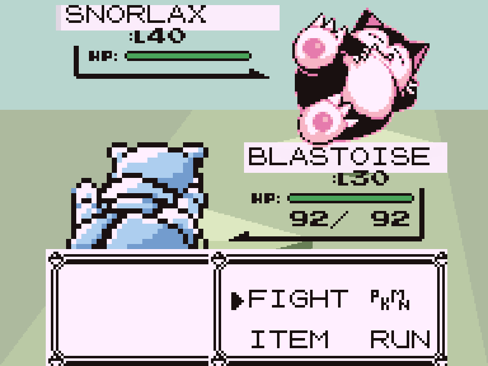
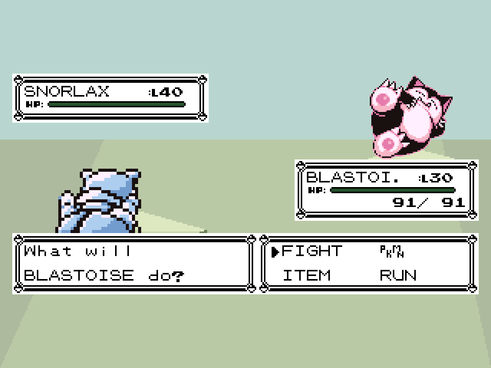
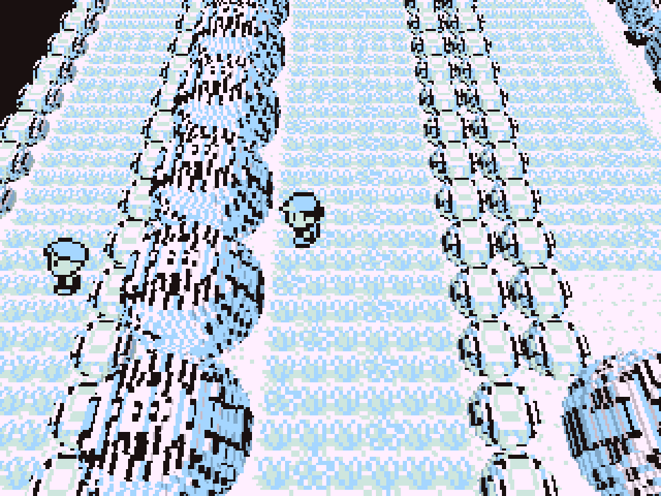

# MLP1 performance — Leaf Voxel

## 0.2.1 battle presentation checks

Test date: 2026-09-06. Read the running device's settings: original battle layout, GBC colours, fixed battle size, standard HUD, white native background, animations enabled and a 30 FPS cap. Leaf Voxel uses its default RES 1/3 and LIGHT battle mode. The test uses a separate on-device copy of those options and the existing isolated save; the user's live game is temporarily suspended in memory and resumed afterward. No saves or user settings are changed.

The 0.2.0 reproduction shows the stage disappearing behind opaque native palette-zone fills during hit shakes and behind the second canvas's white clear during waves. Version 0.2.1 removes those intermediate fills, keeps the shifted/wavy native sprites and UI, and adds only narrow translucent strips behind the classic-layout names. Deliberate move flashes and palette effects remain.

The final 120-second run uses `scripts/benchmark-battle-presentation.lua`: fixed idle, shake and wave cases, followed by a native Surf/Tackle turn and escape back to the forest (`LEAF_BATTLE_END run`). All sampled windows report **zero unwanted zone and wave fills**. Settled battle windows reach **30.00 FPS**, with p95 at most **34.19 ms**. The first Surf/Tackle window drops to **23.59 FPS**; this patch does not resolve first-use effect hitches. Initial loading windows reach 25.58 and 28.19 FPS; returning to the world reaches 29.03 FPS before settling at 30.00.

The isolated test process peaks at **114.0 MiB RSS** across 23 five-second samples, with zero process swap in those samples. The suspended user game remains resident separately. These are sampled process figures; system paging was not measured for this run.

The engine normally bypasses the saved FPS cap in driver mode. The final harness explicitly paces to the copied cap and supplies the matching fixed-step elapsed time to the game's accumulator. This checks rendering at the chosen cap, but does not reproduce normal-loop timing during hitches. The earlier 0.2.0 reproduction ran around 60 FPS before that harness correction, so it is visual evidence, **not a matched performance comparison**.

Evidence: [0.2.0 reproduction](evidence/battle-presentation-0.2.0.log), [0.2.1 run](evidence/battle-presentation-0.2.1.log), [white hit background before](evidence/mlp1-battle-shake-before.png), [names after](evidence/mlp1-battle-names-0.2.1.png), [hit shake after](evidence/mlp1-battle-shake-0.2.1.png), [wave after](evidence/mlp1-battle-wave-0.2.1.png). Ten local tests pass, including removal of intermediate fills, preservation of deliberate flashes/dialogue, name-only strips and restoration of drawing state after errors. LuaJIT syntax checks pass. Device coverage is limited to the configuration and moves above.

## 0.2.0 battle and scene-change checks

Test date: 2026-09-06, same hardware/runtime and isolated data setup described below. Both tests run for 120 seconds at RES 1/3 with the 60 FPS cap, using `scripts/benchmark-scenes.lua`. The scene-change test holds a fixed view after each warp; it is not the moving route used for 0.1.0. GPU frequency varied with the existing governor (300–800 MHz observed); clocks and swap configuration were not changed.

| Door transition | Total time, including fades | Destination mesh ready at reveal |
| --- | ---: | --- |
| First entry to Viridian Forest | 2.635 s | Yes |
| Return to bedroom | 0.712 s | Yes |
| Return to forest | 0.700 s | Yes |
| First entry to Celadon City | 4.052 s | Yes |
| Return to forest from Celadon | 0.713 s | Yes |

The fade holds the main mesh build behind a solid veil, verified with a KMS capture. One departed map is retained within a 12 MiB vertex-buffer limit; this excludes its analysis data, shared models and LÖVE's CPU copy, so it is not a total RAM cap. The transition run peaked at **240.5 MiB RSS** across 58 samples. No process swap or system paging occurred. Connected neighbours still build after the main map is revealed; cold neighbour pop-in remains possible. Startup and failed mesh builds retain the 2D fallback. The added hold times out after four seconds to avoid getting stuck.

The battle test creates a level-30 Blastoise and level-40 Snorlax **in memory only**, uses Surf and Bubblebeam, switches between classic and wide layouts, switches LIGHT → CLASSIC → LIGHT, and escapes back to the forest. Native uipad A/B also opened and cancelled the move menu. The completed battle is explicitly logged as `LEAF_BATTLE_END result=run`.

Settled LIGHT battle windows ran at **59.84–60.05 FPS**, with window p95 at most **18.06 ms**, excluding the initial battle load and the two first-use move windows. Those move windows dipped to **45.68 FPS** (Surf, worst frame 713.48 ms) and **55.27 FPS** (Bubblebeam, worst frame 409.52 ms). The battle load window was 54.93 FPS with a 282.81 ms worst frame. Thus the cached stage is inexpensive during steady play, but this build does not eliminate cold effect hitches. The battle run peaked at **135.7 MiB RSS** across 58 samples, with no process swap or system paging. The in-run CLASSIC windows were also approximately 60 FPS; this is not a matched cold-effects comparison.

Evidence: [battle frames](evidence/battle-0.2.0.log), [battle device samples](evidence/battle-0.2.0-device.log), [transition timings](evidence/transitions-0.2.0.log), [transition device samples](evidence/transitions-0.2.0-device.log), [covered warp](evidence/mlp1-covered-warp.png). A separate short stationary run checked the final battle colours and menu redraws. Nine local tests pass, including cache retention/eviction and fade release on readiness, failure, disable and timeout; LuaJIT syntax checks pass.

These are short Red-engine checks, not a full playthrough or validation of every move, palette, generation, mod combination and display setting.

## 0.1.0 overworld baseline

Test date: 2026-09-06. Experimental overworld renderer, based on Dramaless Shape commit `97ca3e1` (2.0.4).

## Setup and method

- Miniloong Pocket 1: RK3566, Mali GPU, 978,824 kB RAM, Linux 5.10.209.
- Leaf's PortMaster LÖVE 11.5 runtime, GLES/Wayland, fullscreen 960×720; Gen1Recomp 0.2.56 with the Leaf input patches.
- Voxel world at **320×240**, nearest upscaling; UI at 960×720. `VOXEL: ON`, `RES: 1/3`, engine cap 60 FPS. Shadows and water reflections disabled.
- CPU/GPU governor and clocks were left as found. GPU samples report 800 MHz. Leaf launcher suspended during direct runtime tests; existing uipad left active.
- Stock 262,140 kB zram **and an existing 786,428 kB test swapfile** were enabled. These runs do not establish stock-swap-only behavior. The game process's `VmSwap` and system paging counters are recorded separately.
- User-imported Red data and saves were copied **on the device** into a separate `leaf-voxel-test` data root. No ROM, derived asset cache or save was copied off the device or included in the fork. Benchmarks never save.
- `scripts/benchmark.lua` loads the copied bedroom save, enters the named map after 15 seconds, and alternates movement direction every two seconds for a 120-second run. Wild encounters are suppressed **only by this test driver** to keep the graphics workload in the overworld. This is a short repeatable movement loop, not a traversal of the whole map or a gameplay/battle benchmark.
- Frame times are actual elapsed time between driver frames, reported in non-overlapping five-second windows. The engine's driver advances game logic by 1/60 per frame: runs below 60 FPS slow simulated time, so frame throughput alone must not be mistaken for correct gameplay speed.
- `scripts/sample-device.sh` records RSS, process swap, system paging counters, free memory and GPU load every two seconds. RSS numbers below use MiB (kB / 1024). Captures use the device's KMS scanout.

## Results

The final renderer clears the reference project's sustained **30 FPS** target on these two short outdoor routes, with no OOM or paging during the sampled periods. It does **not** maintain 60 FPS in the forest or the city.

| Final scene | Loaded five-second FPS windows | Largest window p95 frame time | Sampled peak RSS | GPU p75 | Process swap / system paging |
| --- | ---: | ---: | ---: | ---: | --- |
| Viridian Forest, original rounded trees | 52.33–54.32 (median 53.50) | 26.15 ms | 135.7 MiB | 97% | 0 / none |
| Celadon City, rounded trees + flat building surfaces | 48.48–55.91 (median 52.94) | 26.74 ms | 244.1 MiB | 88% | 0 / none |

Forest frame windows use t≥30s; city windows use t≥60s. Both enter the named map at t≈15s. Forest device sampling covers only the final 30 seconds (15 samples), so its RSS figure is **not a whole-run peak**. City has 58 samples spanning almost the full run. The city route briefly crosses Route 16 and returns while neighbors build; its slowest five-second window was 39.50 FPS, with a 119.88 ms worst frame during cold work. Forest's first voxel window was 53.07 FPS, with a 172.02 ms cold-build hitch. Both current-map meshes were visible within the first five-second window after entry.

The starting bedroom also renders, but startup/restore is excluded from the outdoor figures. The 120-second runs exit normally. Evidence: [forest frames](evidence/forest-rounded-final.log), [forest device samples](evidence/forest-rounded-final-device.log), [city frames](evidence/celadon-trees-final.log), [city device samples](evidence/celadon-trees-device.log).

## What changed

Removed voxel battles and companion/Stadium integrations, predictive precaching, the previous neighborhood's retained meshes and dense 3D grass. Trees and stumps preserve the original rounded hulls; one mesh is shared per distinct drawing, and only placements intersecting the camera frustum are drawn. Bins and potted plants use textured boxes. Buildings keep their authored footprints and textures, with flat roof and wall surfaces; pixel slopes and recessed windows are removed. Small furniture retains its detailed models.

The world shader is a small textured vertex-shading pass. Mesh generation packs binary vertex data through LÖVE's sandbox-permitted data API and uploads bounded batches. Outdoor buildings are assembled directly from tile-sized quads, avoiding a scan through the solid voxel volume. The retained furniture generator yields inside its expensive inner loops.

Earlier cuts boxed every tree and reached 60 FPS in the forest and towns, but lost the recognisable silhouettes. The final version restores the original rounded trees and accepts the measured frame-rate cost. Sharing their meshes avoids duplicating millions of vertices across the map; frustum tests exclude offscreen placements.

The building change remains: a diagnostic Celadon run with detailed voxel buildings took roughly 90 seconds after entry before its mesh appeared. Direct roof/wall surfaces reduced that to under five seconds. The retained `celadon-before-building-cut` logs use different tree geometry from the final measurements and are diagnostic context only.

## Earlier baseline

The separate [Leaf-Gen1Recomp hardware report](https://github.com/Helaas/Leaf-Gen1Recomp/blob/main/HARDWARE.md) records Dramaless 2.0.4 exhausting stock swap and being OOM-killed after roughly 90 seconds; with additional swap it survived but paged in 27/45 samples with GPU p75 99%. PotatoVoxel's low preset also saturated the GPU and became unresponsive. These are prior observations from that project's local `HARDWARE.md`, using its own route and procedure, rather than an A/B run of this driver.

## Normal controller smoke test

The game was also launched without `POKEPORT_DRIVER`, using the isolated data root. The existing uipad navigated the title menu, selected Continue, accepted the expected mod-change notice, reached the voxel bedroom, moved with the D-pad and opened the full-resolution Start menu. This checks the normal frame loop and controller path separately from scripted throughput.

## Limits

Cold meshes are generated in the background; the engine displays its 2D fallback until the current map's mesh is ready, then the voxel view appears. Individual cold-build frames can still hitch. This prototype has not been played through the full game, tested with other mods, or checked across every palette, map, camera angle and resolution setting. Battles intentionally retain the engine's original 2D rendering.
